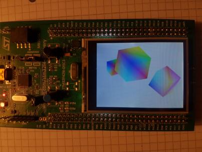

# cOpenGL

C implementation of OpenGL basics for ARM CPU devices with an example for STM32F429 Discovery board.

The library relies on [linmath.h](https://github.com/dizcza/linmath.h) that provides a simple implementation of matrix manipulations in 3D graphics. In order to install linmath, run 

```
git clone https://github.com/dizcza/cOpenGL.git --recursive
```


cOpenGL bin and elf binary files are shared on Google Drive with this [link](https://drive.google.com/drive/folders/0B5LYlYDnS3oHMWpkVGVkTzVuZUU?resourcekey=0-wuHBtv6pyzeQvAtLxgnNeg&usp=sharing).

## Features

### Implemented

* The [depth buffer](https://en.wikipedia.org/wiki/Z-buffering) is used to solve the visibility problem (hidden 3D objects are not drawn).
* Can draw _any_ object as long as its [polygon mesh](https://en.wikipedia.org/wiki/Polygon_mesh) is provided (vertices positions and colors are required).
* Fast framebuffer clear (both color and depth) using DMA, which is called on each redraw of a 3D scene.
* [Barycentric coordinates](https://www.scratchapixel.com/lessons/3d-basic-rendering/ray-tracing-rendering-a-triangle/barycentric-coordinates) for smooth color interpolation between vertices.

### Not implemented

* Ray tracing.
* Lighting and shadows.
* Textures.
* Antialiasing.


The basis function is

```c
void FrameBuffer_ProjectTrian4(FrameBuffer* frame, trian4 trian, vec3uint32 vcolors, mat4x4 mvp);
```

that projects an arbitrary 3D triangle onto the screen.


**Note**. This project is educational: the aim is to show how to implement OpenGL basics from scratch. Be aware of the performance issues (see benchamrk below) before using the library.


## YouTube Demo

[](https://youtu.be/djybFXNTcbc)


## Benchmark

Benhmark is measured by FPS (frames per second) on the scene with 3 cubes for different optimization flags with asserts turned off.

| Checkpoint  | -O0   | -Os   | -O1  | -O2  | -O3  |
|-------------|-------|-------|------|------|------|
| Apr 18, 2017 | 1.25 | 5.38  | 6.10 | 7.81 | 8.48 |


## Known hardware issues

* Touchscreen is not working in interruption mode (`BSP_TS_IT*`).
* Touchscreen refuses to initialize after a few hardware resets, if compiled with optimization flag `-On` for any `n>0`. For some reason,  `stmpe811_ReadID()` returns `0` instead of `0x0811`.


# Similar projects

* [ST7735](https://github.com/cbm80amiga/ST7735_3d_filled_vector) is another port of OpenGL on STM32, using Q1.15 fixed precision float format.
* [FGL](https://bitbucket.org/acassis/apps_fgl) port on STM32 Discovery board ([video](https://www.youtube.com/watch?v=XOdfvi7cgLc)).
* [arduinogl](https://github.com/fabio914/arduinogl) OpenGL port on Arduino that neglects depth and can draw lines only.
* Doom ports:
  - [stm32doom](https://github.com/floppes/stm32doom): not OpenGL, and not even 3D (it's 2.5D), but highly optimized;
  - [esp32-doom](https://github.com/app-z/esp32-doom) and [video](https://www.youtube.com/watch?v=TFE2ri2Zgu4) (don't know the details).


